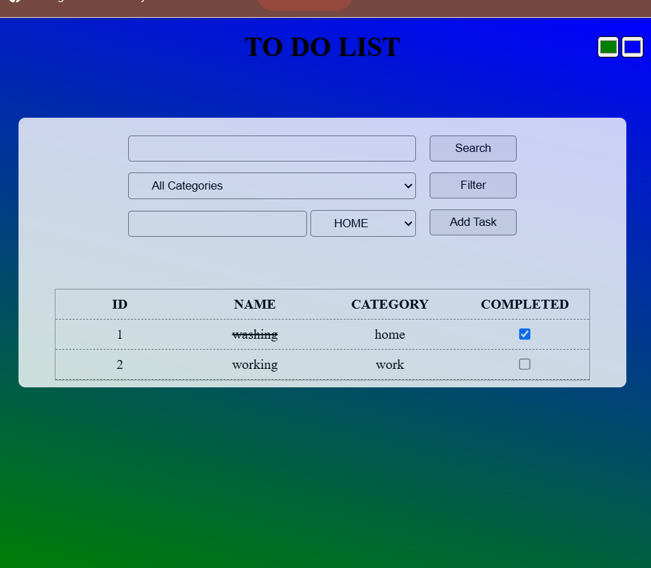

📝 Vanilla JS To-Do List App
A lightweight, responsive To-Do List application built with pure JavaScript and CSS. Customize your workspace with dual color pickers, and manage your tasks with intuitive add, filter, and search features—no frameworks, no dependencies.

🌟 Features
- 🎨 Dual Color Pickers
Personalize the background with two color inputs to create custom gradients or solid colors.
- 📱 Responsive Design
Works seamlessly across desktops, tablets, and mobile devices.
- ➕ Add Tasks
Quickly add tasks with a clean input field and button.
- 🔍 Search Tasks
Instantly find tasks using a search input and button.
- 🧹 Filter Tasks
Toggle between different categories.

🚀 Getting Started
1. Clone the Repository
git clone https://github.com/rasoulnasserifreelancer/To-Do-List.git
2.navigate into the project folder
cd To-Do-List
3. Open in Browser
Simply open index.html in your preferred browser. No build tools or installations required.
🛠️ Technologies Used
- HTML5 – Structure
- CSS3 – Styling and responsiveness
- JavaScript (ES6) – Logic and interactivity

📸 Screenshots

🌟 Live Demo
👉 View on Vercel
((https://to-do-list-app-beryl-seven.vercel.app/))

📬 Contributing
Pull requests are welcome! Feel free to fork the project and submit improvements.
📄 License
This project is licensed under the MIT License.

